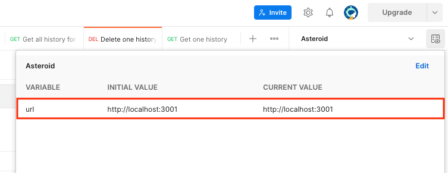

# **Asteroids backend**

  

Table of content

- [Abstract](#abstract)
  - [Architecture](#architecture)
- [Usage](#usage)
  - [Install](#install)
  - [Launch in dev](#launch-in-dev)
  - [Launch in prod](#launch-in-prod)
- [More](#more)
  - [Postman](#postman)
  - [Libraries](#libraries)

## Abstract

This is the supporting backend for the Slingshot Asteroids tests.

This backend provide an easy to setup backend managing the creation and a simple lifecycle of a space simulation where Planets compete for ressources, sending miners to different asteroids to gather more minerals than others.

### Architecture

That project contains 4 base models described bellow

| Model        | List/Get one  | Custom list | Create/Update/Delete | Description |
| ------------ | ------------- | ----------- | -------------------- | ----------- |
| Planet       | X             |             | X                    | **Model** represents a planet in the system. It contains spacial coordinates (2D), a mineral stock and a amount of miners.  **Router** contains a full CRUD. |
| Miner        | X             | For planet  | X                    | **Model** represents Planet's miner. It also contains spacial coordinates (2D), a mineral stock as well as some stats and the current status of the miner. In addition, an angle is also present for orientation on a 2D map.  **Router** contains a full CRUD + a query param in the list allow to fetch all Miners for a specific Planet. |
| Asteroid     | X             |             | X                    | **Model** representing an asteroid in the system. It contains spacial coordinates (2D) and a mineral stock, the current asteroid status and eventually the miner currently mining it.  **Router** contains a full CRUD. |
| History      | X             | For Miner   | X                    | **Model** representing an action done by a miner. It contains the Miner's information at the time and all relevant info related to the miner's action.   **Router** contains a full CRUD but the create/update/delete doesn't need to be called by the frontend as the history is managed by the backend. In the list route, a query param allow to fetch all history for a specific Miner. |

## Usage

### Install

In order to make the project work, you'll have to:

- **1.** Dependencies

Install all the libraries required to launch the project. To do so, simply go into the main folder (the one containing the package.json file) and run the following:
> $> npm i

- **2.** Launch

Pick a way to launch the project in the following sections

### Launch in dev 🚀

To launch the app in dev mode you'll have to launch
> $> node server

or
> $> nodemon server

The second option allow the webserver to be refresh everytime you modify and simplify the live testing on local.

### Launch in prod 🚀

For the deployment on production, you can then run the project using pm2. If pm2 isn't installed on the system yet, you can install it by running:

> $> npm install -g pm2

Once you have pm2 installed, you can run you project in production mode with the following

> $> pm2 start index.js --name asteroid

After the app is up and running, if you want to deploy the app with apache2, it will be required to enable a module to handle the websocket. To do so, simply run the following:

> $> sudo a2enmod proxy_wstunnel

Then you can restart the apache server and the websocket should become accessible with your domain name

> $> systemctl restart apache2

## More

### Postman

In order to help testing the api, we provide a Postman collection that you can import into your Postman.

The file is located there: [Asteroid.postman_collection.json](Asteroid.postman_collection.json)

All of the routes are formulated like "{{url}}/route/to/test", so you'll have to create an environment with the variable containing your url (like on the following screenshot)

### Libraries

For this project we are using the following libraries

| Name               | Version | Usage |
| ------------------ | ------- | ----- |
| [body-parser](https://www.npmjs.com/package/body-parser) | ^1.20.0 | Parse incoming request bodies in a middleware before your handlers, available under the req.body property. |
| [express](https://www.npmjs.com/package/express) | ^4.18.0 | Base framework for the application |
| [mongoose](https://www.npmjs.com/package/mongoose) | ^6.3.1 | Mongoose is a MongoDB object modeling tool designed to work in an asynchronous environment. |
| [socket.io](https://www.npmjs.com/package/socket.io) | ^4.5.0 | Socket.IO enables real-time bidirectional event-based communication.  |
